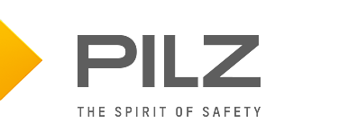

# pilz_common
This repository contains packages and sources used across different PILZ ROS packages.

### Build Status
Coming Soon!

#### Branching model
`noetic-devel` is considered to be the active development branch.

## Package: pilz_industrial_motion_testutils
Contains helper classes and functions that are used by the tests.

## Package: pilz_msgs
Contains all custom ROS message types needed for various PILZ packages.

## Package: pilz_testutils
Provides additional tools when performing googletests.

## Package: pilz_utils
Provides tools used across various other PILZ packages.

## You need further information?
Our international hotline staff will support you individually about our ROS packages at ros@pilz.de

Find more information about the Pilz ROS modules on the [product website](https://www.pilz.com/en-INT/products/robotics/ros-modules).

## Visit us at [pilz.com](https://www.pilz.com)
Pilz is an international-scale, innovative automation technology company.
Pilz uses its solutions to create safety for man, machine and the environment.
In addition to head office in Ostfildern near Stuttgart,
the family business is represented over 2,400
employees at 42 subsidiaries and branches on all
continents.

The company’s products include sensor technology, electronic monitoring relays, safety
relays, configurable and programmable control systems, automation solutions with motion
control, systems for industrial communication as well as visualization solutions and
operator terminals.

Pilz solutions can be used in all areas of mechanical engineering, including the packaging
and automotive sector, plus the railway technology, press and wind energy sectors.
These solutions ensure that baggage handling systems run safely at airports and
funiculars or roller coasters travel safely; they also guarantee fire protection and energy
supply in buildings.
